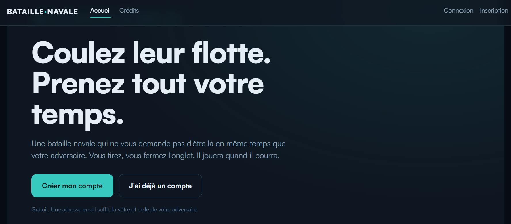

# Bataille Navale

Bataille Navale est un jeu de bataille navale en ligne, au tour par tour et asynchrone : les deux joueurs n'ont pas besoin d'être connectés en même temps, chacun joue son tour quand il revient sur le site.

Il s'adresse aux joueurs qui veulent s'affronter à distance : un joueur inscrit crée une partie, invite son adversaire grâce à l'adresse email de son compte, puis suit ses parties en cours et leur historique.

Le projet a été réalisé en équipe de trois, en **React** et **TypeScript**, dans le cadre du Bachelor 2 Informatique d'Ynov Campus Nantes.

## Technologies utilisées

- **React** : construction de l'interface
- **TypeScript** : JavaScript typé
- **Vite** : serveur de développement et build
- **React Router** : navigation entre les pages
- **CSS Modules** : styles isolés par composant
- **Deno** et **SQLite** : serveur backend (fourni séparément)

## Prérequis

- [Node.js](https://nodejs.org/) et npm
- [Deno](https://deno.com/) 2.9 ou plus, pour lancer le serveur backend

## Installation et démarrage
> Ici, vous allez voir comment démarrer le projet sur votre ordinateur.

### 1. Le serveur backend, l'API
Commencer par vous déplacer vers le dossier du serveur :

```bash
cd bataille/game-server
```

Maintenant que vous êtes dans ce dossier, utilisez la commande suivante pour ouvrir l'API :

```bash
deno task dev
```

Le serveur écoute par défaut sur `http://localhost:8000`. Sa documentation interactive est disponible sur `http://localhost:8000/docs`.

### 2. Le frontend
Cette fois-ci, il vous faudra tout d'abord aller dans le dossier contenant le frontend, il se trouve dans le dossier `bataille`.
Vous pouvez y aller en faisant :
```bash
cd bataille
```

S'il s'agit de votre premier démarrage, vous devrez tout d'abord télécharger les dépendances. Pour cela, faites :
```bash
npm install
```

Maintenant que vous êtes dans le bon dossier avec toutes les dépendances, démarrez le projet avec :
```bash
npm run dev
```

L'application est alors accessible à l'adresse affichée dans le terminal (généralement `http://localhost:5173`).

> Les deux serveurs doivent tourner en même temps pour que l'inscription et la connexion fonctionnent.

> Si vous rencontrez une erreur, partagez-la nous dans une issue pour que nous puissions la corriger, bonne partie !

### 3. Le résultat attendu



## Pages de l'application

| Route | Page |
| --- | --- |
| `/` | Accueil |
| `/inscription` | Création de compte |
| `/connexion` | Connexion |
| `/parties` | Mes parties |
| `/parties/nouvelle` | Nouvelle partie |
| `/parties/:id` | Une partie |
| `/historique` | Historique des parties |
| `/credits` | Crédits |

## Authentification

L'inscription (`POST /auth/signup`) et la connexion (`POST /auth/login`) prennent un **email** et un **mot de passe**. Le serveur renvoie un **token**, nécessaire pour appeler les autres routes de l'API. L'inscription connecte automatiquement l'utilisateur.

## Architecture

L'application se compose de deux blocs : une interface web écrite en React et TypeScript (dossier `bataille/`), lancée avec Vite pendant le développement, et un serveur de jeu Deno + SQLite fourni par l'école (dossier `bataille/game-server/`).

L'interface communique avec le serveur par des requêtes HTTP vers son API REST, sur `http://localhost:8000` : inscription, connexion, création de partie, invitation et envoi de chaque tour. Le serveur conserve les comptes et l'état des parties dans une base SQLite, ce qui permet de reprendre une partie plus tard.

Schéma détaillé : `docs/architecture.md` (produit en séance 3, pas encore présent).

## Documentation détaillée

- [Guide de démarrage](bataille/docs/readme-demarrage.md) : procédure complète pour lancer le projet.
- [Réglages](bataille/docs/reglages.md) : taille de la grille, nombre de bateaux et leurs valeurs acceptées.

## Usage

Vous pouvez utiliser ce jeu de bataille navale comme base pour créer votre propre jeu de bataille navale sans devoir recréer les bases du jeu. Vous pouvez également l'utiliser pour voir comment ce jeu fonctionne, si vous êtes curieux ! Ou bien, vous pouvez l'utiliser pour tout simplement jouer au jeu et passer un bon moment.

## Organisation du dépôt

| Chemin | Contenu |
| --- | --- |
| `README.md` | Cette page : présentation, installation, architecture, contribution. |
| `bataille/` | Projet React et sa configuration (`package.json`, `vite.config.ts`, `tsconfig.json`). |
| `bataille/src/App.tsx` | Déclaration des routes de l'application. |
| `bataille/src/pages/` | Une page par dossier (Accueil, Connexion, Inscription, Mes parties, etc.). |
| `bataille/src/components/` | Composants réutilisables (carte d'une partie, mini-radar, barre de navigation…). |
| `bataille/src/Layouts/` | Mise en page commune à toutes les pages. |
| `bataille/src/context/` | État global partagé : utilisateur connecté et joueur. |
| `bataille/src/services/` | Fonctions d'appel à l'API du serveur de jeu. |
| `bataille/src/GridFunctionality/` | Logique de la grille de jeu : création, placement des bateaux, lecture et écriture de l'état. |
| `bataille/src/index.css` | Variables de thème partagées (couleurs, police). |

Chaque page a son propre fichier `NomDeLaPage.module.css`. Les couleurs et la police viennent des variables définies dans `index.css` (`var(--texte)`, `var(--sonar)`, etc.) pour garder un rendu cohérent.

## Contribuer
Toute modification de ce projet passe par une Pull Request dédiée à une issue (un groupe d'issues) en particulier. Si vous voyez un problème ou un ajout à réaliser sur ce projet, il vous faudra donc faire une issue décrite en quatre étapes. Créer une branche qui sera dédiée à la résolution de cette issue puis faire une Pull Request en y assignant un autre membre du groupe. Celui-ci relira votre travail et pourra ainsi valider ou non son ajout dans le projet.
Les commandes d'installation des dépendances du projet sont décrites ci-dessus.

## Contact
| Prénom/Nom | E-Mail |
| --- | --- |
| [Emerick Pacaud](https://github.com/Emerick2) | pacaudemerick@gmail.com|
| [Armel Zion](https://github.com/Armel-zion) | goyglouxarmel.zion@ynov.com
| [Paul-Elie Kouakou](https://github.com/pauloo10-ynov) | 

Pour toute question ou tout problème, [ouvrez une issue](https://github.com/Emerick2/Bataille-navale/issues) sur ce dépôt.
 
