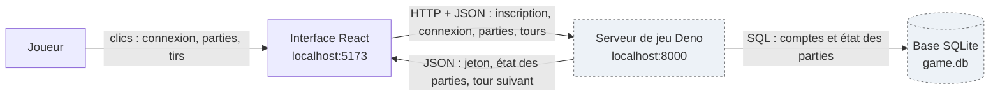

# Architecture de Bataille Navale

Vue d'ensemble : les blocs du système et ce qui circule entre eux.

**Légende** : bloc plein = code de l'équipe ; bloc en pointillés = fourni par l'école, hors périmètre du projet.

## Explication

Le joueur utilise l'interface React dans son navigateur. À chaque action (connexion, création ou invitation, tir), l'interface envoie une requête HTTP au serveur de jeu, avec un jeton d'authentification (*token*) dans l'en-tête `Authorization`. Ce jeton est obtenu à la connexion et conservé dans le `sessionStorage` du navigateur.

Le serveur de jeu enregistre les comptes et l'état de chaque partie dans une base SQLite (`game.db`). C'est ce qui rend le jeu asynchrone : un joueur peut fermer son navigateur et reprendre la partie plus tard, là où elle s'était arrêtée.

*État valable au 6 octobre 2026, à revoir à chaque changement d'architecture.*